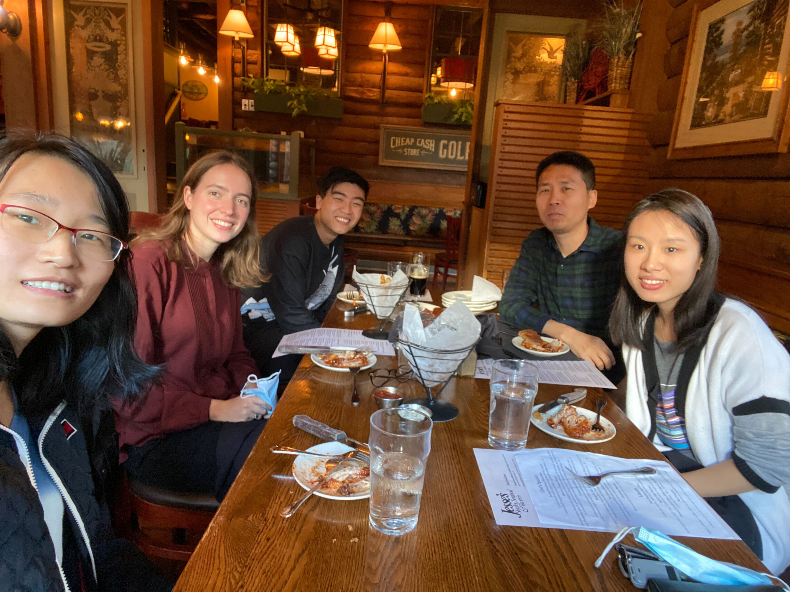
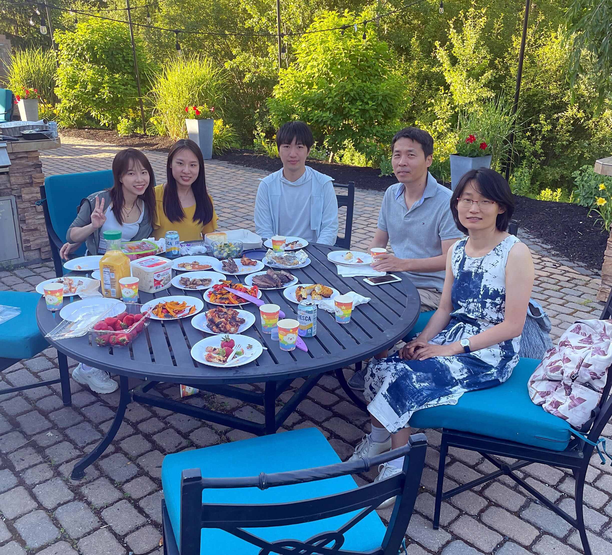

---
# A Demo section created with the Blank widget.
# Any elements can be added in the body: https://wowchemy.com/docs/writing-markdown-latex/
# Add more sections by duplicating this file and customizing to your requirements.

widget: blank  # See https://wowchemy.com/docs/page-builder/
headless: true  # This file represents a page section.
weight: 20  # Order that this section will appear.
title: ""
subtitle: ""
design:
  # Choose how many columns the section has. Valid values: 1 or 2.
  columns: 1
  background:
    color: '#ecf9ec'
advanced:
  css_style:
  css_class:
---

  

