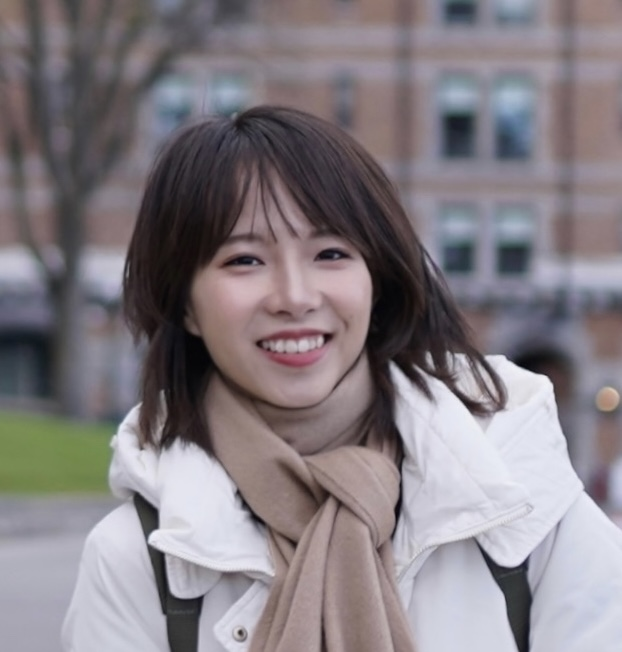

|                           _Member_                           | _Date joined_ |       _Role_       | _Description_                                                |
| :----------------------------------------------------------: | :-----------: | :----------------: | :----------------------------------------------------------- |
| 

 
Siming Zhao Ph.D.
 |    7/2021     |         PI         | Siming is an assistant professor in the department of biomedical data science and the Cancer Center at Dartmouth College. She completed her PhD from Yale University in Dr. [Richard Lifton](https://www.rockefeller.edu/our-scientists/heads-of-laboratories/1139-richard-p-lifton/)'s lab (now in Rockefeller University). She received post-doctoral training at University of Chicago, under the guidance of Drs. [Matthew Stephens](https://stephenslab.uchicago.edu/) and [Xin He](http://xinhelab.org/).  Siming has broad training in genetics, cancer biology, bioinformatics and statistical genetics.In the past, she has developed computational methods to study the genetics of cancer and other complex diseases. She has also led the analysis of several cancer whole-exome sequencing projects. She is interested in the roles of genetic variations in cancer and computational methods to translate large-scale genomic data into disease mechanisms. |
| 

 
Liyang Yu, M.S.
 |    6/2022     |  Graduate Student  | Liyang Yu obtained her BS in Molecular Biology from Johns Hopkins University and MS in Biostatistics from Washington University in St.Louis. She is a QBS PhD student and joined the lab in May 2022. She is interested in functional genomics of human diseases and development and application of statistical genetics methods. |
| 

 
Qiaoxue Liu, M.S.
 |    2024/6     |  Graduate Student  | Qiaoxue Liu is a PhD student in the Quantitative Biomedical Sciences (QBS) program at Dartmouth College and she joined the lab in June 2024. Prior to her PhD studies, she earned an MS in Biostatistics from the University of Michigan and completed dual BS degrees in Statistics and Applied and Computational Math Sciences from the University of Washington. Her research interests focus on developing statistical tools for GWAS data. |
| 

 
 Qirui Zhang.
 |    2024/7     | Research assistant | Qirui Zhang obtained his BS in Pharmaceutical Sciences from Zhejiang University, China. He is currently a Master student in Biostatistics at New York University and joined the lab in July 2024. He is interested in using deep learning methods to analyze genomic data. |
| 

 
 Luke Deary, Ph.D.
 |    2024/9     |      Postdoc       | Dr. Luke Deary graduated from the Dartmouth MCB program. He did his thesis work in Dr. Xiaofeng Wang's lab working on the role of ARID1A using the organoid system. He is interested in understanding disease mechanisms using human genetics data. Currently, he leverages functional genomic and perturbation experiments to study disease genes. |

### Rotation students

Hannah Stuart (2022 Fall, QBS program), Andrew McCray (2023 Spring, MCB program). Minghui Zhang (2023 fall, QBS program). Graham Shultz (2024 QBS program). 

### Past members

| _Member_                                                     | _Date in lab_ | _Role_                                                       |
| ------------------------------------------------------------ | ------------- | ------------------------------------------------------------ |
| 

 
Jie Zhou, Ph.D.
 | 3/2022-7/2024 | Research Scientist.  Jie Zhou received his Ph.D. in Statistics in 2009 from the Department of Applied Mathematics, Xidian University, China. His research focused on the statistical inference of nonlinear systems and the identification of high-dimensional biological networks. Jie joined the lab in March 2022 and worked on cancer somatic mutations. He is currently a research scientist in Anne Hoen's lab at Dartmouth. |
| 

 
Nick Sugiarto
 | 9/2021-6/2023 | Undergraduate Researcher (Joint with Xiaofeng Wang lab). Nick worked on bioinformatic analysis of functional genomics data. He is currently a research associate at Harvard. |

Michael Meng (2021-2022), QBS master student, part-time research assistant
Jihyun Lee (2021), QBS master student, part-time research assistant
Alisa Tvorun Dunn(2021),QBS master student, part-time research assistant

