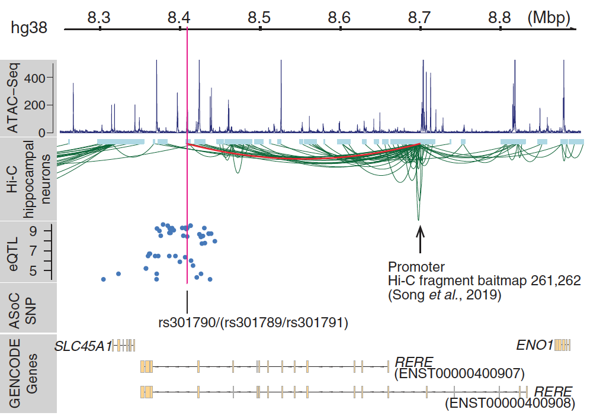

asdfjasldkjflasdjglskjdglkjsdlgjlsjg sdgjfs jgldkjglj sd
asdfjasldkjflasdjglskjdglkjsdlgjlsjg sdgjfs jgldkjglj sd
asdfjasldkjflasdjglskjdglkjsdlgjlsjg sdgjfs jgldkjglj sd
asdfjasldkjflasdjglskjdglkjsdlgjlsjg sdgjfs jgldkjglj sd

asdfjasldkjflasdjglskjdglkjsdlgjlsjg sdgjfs jgldkjglj sd
asdfjasldkjflasdjglskjdglkjsdlgjlsjg sdgjfs jgldkjglj sd
asdfjasldkjflasdjglskjdglkjsdlgjlsjg sdgjfs jgldkjglj sd
asdfjasldkjflasdjglskjdglkjsdlgjlsjg sdgjfs jgldkjglj sd
