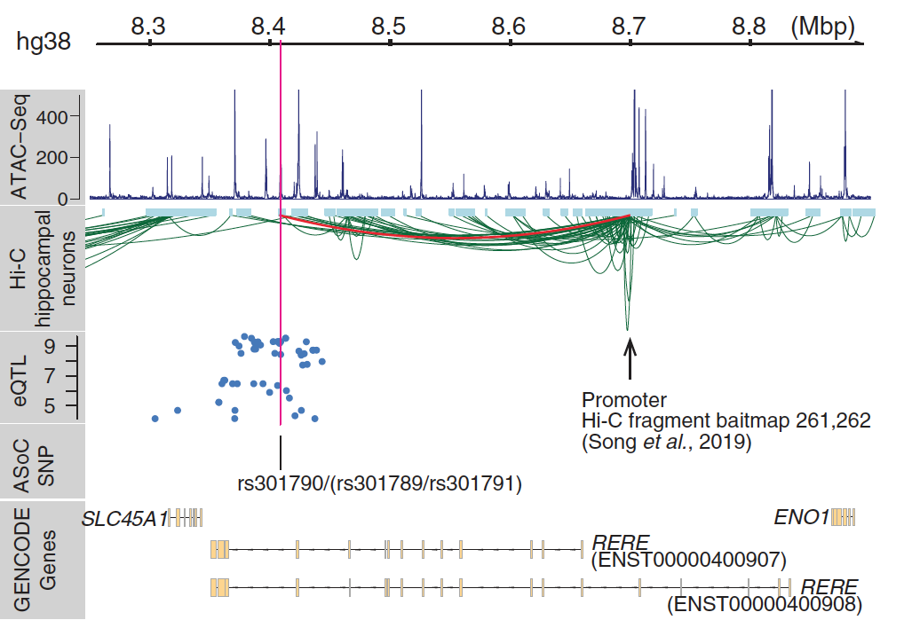

## Research overview
Our group focuses on studying the genetic etiology of human diseases, in particular, cancer.  We develop computational methods and tools to analyze large-scale genomic datasets, aiming to translate data into biological insights. Specific areas of interest include modeling of mutation selection in cancer,  integration of multiple types of genomic datasets for disease gene discovery, genotype-phenotype association analysis, *etc*. 

## Selection of mutations in Cancer
asdfjasldkjflasdjglskjdglkjsdlgjlsjg sdgjfs jgldkjglj sd
asdfjasldkjflasdjglskjdglkjsdlgjlsjg sdgjfs jgldkjglj sd
asdfjasldkjflasdjglskjdglkjsdlgjlsjg sdgjfs jgldkjglj sd
asdfjasldkjflasdjglskjdglkjsdlgjlsjg sdgjfs jgldkjglj sd

asdfjasldkjflasdjglskjdglkjsdlgjlsjg sdgjfs jgldkjglj sd
asdfjasldkjflasdjglskjdglkjsdlgjlsjg sdgjfs jgldkjglj sd
asdfjasldkjflasdjglskjdglkjsdlgjlsjg sdgjfs jgldkjglj sd
asdfjasldkjflasdjglskjdglkjsdlgjlsjg sdgjfs jgldkjglj sd

## Functional genomics of human diseases

asdfjasldkjflasdjglskjdglkjsdlgjlsjg sdgjfs jgldkjglj sd
asdfjasldkjflasdjglskjdglkjsdlgjlsjg sdgjfs jgldkjglj sd
asdfjasldkjflasdjglskjdglkjsdlgjlsjg sdgjfs jgldkjglj sd
asdfjasldkjflasdjglskjdglkjsdlgjlsjg sdgjfs jgldkjglj sd

asdfjasldkjflasdjglskjdglkjsdlgjlsjg sdgjfs jgldkjglj sd
asdfjasldkjflasdjglskjdglkjsdlgjlsjg sdgjfs jgldkjglj sd
asdfjasldkjflasdjglskjdglkjsdlgjlsjg sdgjfs jgldkjglj sd
asdfjasldkjflasdjglskjdglkjsdlgjlsjg sdgjfs jgldkjglj sd

## Statistical methods for genome wide association analysis
asdfjasldkjflasdjglskjdglkjsdlgjlsjg sdgjfs jgldkjglj sd
asdfjasldkjflasdjglskjdglkjsdlgjlsjg sdgjfs jgldkjglj sd
asdfjasldkjflasdjglskjdglkjsdlgjlsjg sdgjfs jgldkjglj sd
asdfjasldkjflasdjglskjdglkjsdlgjlsjg sdgjfs jgldkjglj sd

asdfjasldkjflasdjglskjdglkjsdlgjlsjg sdgjfs jgldkjglj sd
asdfjasldkjflasdjglskjdglkjsdlgjlsjg sdgjfs jgldkjglj sd
asdfjasldkjflasdjglskjdglkjsdlgjlsjg sdgjfs jgldkjglj sd
asdfjasldkjflasdjglskjdglkjsdlgjlsjg sdgjfs jgldkjglj sd