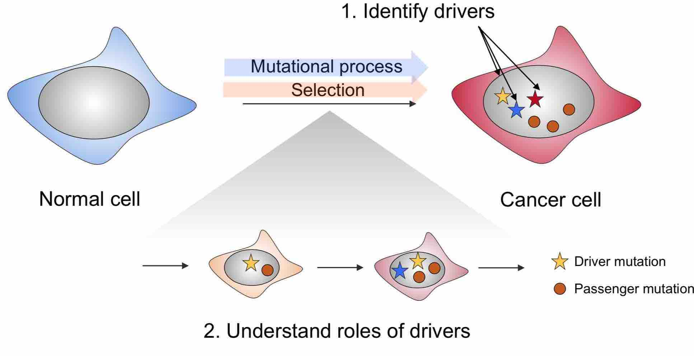

## Research overview
Our group focuses on studying the genetic etiology of human diseases, in particular, cancer.  We develop computational methods and tools to analyze large-scale genomic datasets, aiming to translate data into biological insights. Specific areas of interest include modeling of mutation selection in cancer,  integration of multiple types of genomic datasets for disease gene discovery, genotype-phenotype association analysis, *etc*. 

## Selection of mutations in cancer

Selection of mutations is the driving force behind adaptive evolution. During this process, a small fraction of mutations conferring survival and growth advantage are positively selected (driver mutations). The disease of cancer is mainly driven by positive selection in somatic cells. At the end of this evolutionary process, tumors acquire highly heterogeneous phenotypes, such as different treatment responses and diverse molecular profiles. Identification of driver mutations and characterizing how they contribute to specific phenotypes are crucial for a deeper understanding of the genetic etiology of cancer. 

We have recently developed a powerful statistical framework to study positive selection of mutations in cancer. 

## Functional genomics of human diseases

asdfjasldkjflasdjglskjdglkjsdlgjlsjg sdgjfs jgldkjglj sd
asdfjasldkjflasdjglskjdglkjsdlgjlsjg sdgjfs jgldkjglj sd
asdfjasldkjflasdjglskjdglkjsdlgjlsjg sdgjfs jgldkjglj sd
asdfjasldkjflasdjglskjdglkjsdlgjlsjg sdgjfs jgldkjglj sd

asdfjasldkjflasdjglskjdglkjsdlgjlsjg sdgjfs jgldkjglj sd
asdfjasldkjflasdjglskjdglkjsdlgjlsjg sdgjfs jgldkjglj sd
asdfjasldkjflasdjglskjdglkjsdlgjlsjg sdgjfs jgldkjglj sd
asdfjasldkjflasdjglskjdglkjsdlgjlsjg sdgjfs jgldkjglj sd

## Statistical methods for genome wide association analysis
asdfjasldkjflasdjglskjdglkjsdlgjlsjg sdgjfs jgldkjglj sd
asdfjasldkjflasdjglskjdglkjsdlgjlsjg sdgjfs jgldkjglj sd
asdfjasldkjflasdjglskjdglkjsdlgjlsjg sdgjfs jgldkjglj sd
asdfjasldkjflasdjglskjdglkjsdlgjlsjg sdgjfs jgldkjglj sd

asdfjasldkjflasdjglskjdglkjsdlgjlsjg sdgjfs jgldkjglj sd
asdfjasldkjflasdjglskjdglkjsdlgjlsjg sdgjfs jgldkjglj sd
asdfjasldkjflasdjglskjdglkjsdlgjlsjg sdgjfs jgldkjglj sd
asdfjasldkjflasdjglskjdglkjsdlgjlsjg sdgjfs jgldkjglj sd