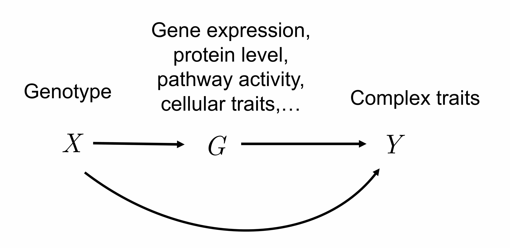

##  *Research overview* 
Our group focuses on studying the genetic etiology of human diseases, in particular, cancer.  We develop computational methods and tools to analyze large-scale genomic datasets, aiming to translate data into biological insights. Specific areas of interest include modeling of mutation selection in cancer, integration of multiple types of genomic datasets for disease gene discovery, genotype-phenotype association analysis, *etc*.  
&nbsp;
&nbsp;

##  *Selection of mutations in cancer* 

Selection of mutations is the driving force behind adaptive evolution. During this process, a small fraction of mutations conferring survival and growth advantage are positively selected (driver mutations). The disease of cancer is mainly driven by positive selection in somatic cells. At the end of this evolutionary process, tumors acquire highly heterogeneous phenotypes, such as different treatment responses and diverse molecular profiles. Identification of driver mutations and characterizing how they contribute to specific phenotypes are crucial for a deeper understanding of the genetic etiology of cancer. 

We have recently developed a powerful statistical framework to study positive selection of mutations in cancer ([*Zhao S* 2019](https://www.nature.com/articles/s41467-019-11284-9)). This framework allows us to integrate information from various sources to separate selection signals from complex mutational processes. We are interested in using this framework to identify driver mutations and study how these mutations lead to specific tumor properties. 

&nbsp;
&nbsp;

##  *Functional genomics of human diseases* 

One major goal of disease genetics is to understand how genetic variations affect disease phenotypes. Many genetic variations have been identified to significantly associate with diseases, e.g. through genomic-wide associations avalysis, however the mechanisms remain illusive. With accumulating data providing functional annotations for the genome, such as [ENCODE](https://www.encodeproject.org/) and [GTEx](https://gtexportal.org/home/) projects, we are now able to analyze the associations between genetic variation and disease phenotype in more detail.

We will be collaborating with wet lab experimentalists to collect functional genomics data to illucidate disease mechanisms. We are interested in integrating data from ATAC-seq, RNA-seq, Hi-C seq and single cell sequencing, *etc* for disease gene discovery. For example, in our recent paper ([*Zhang S* 2020](https://science.sciencemag.org/content/369/6503/561.abstract)), we integrate chromatin accessibility profiles with other omics data to prioritize schizophrenia associated genetic variations. We found a group of genetic variations, we called ASoC (allele specific open chromatin) variants, are highly enriched with disease variants, and they may potentially regulate gene expression by affecting the chromatin status of gene promotor regions. 

&nbsp;
&nbsp;

##  *Statistical methods for GWAS* 

Recent collection of genetic and phenotype data has become increasingly large. For instance, the [UK biobank](https://www.ukbiobank.ac.uk/) project has collected genetic and health data for > 500,000 individuals. This allows researchers to perform more powerful genome-wide association analysis (GWAS). We are interested in developing statistical methods used in large-scale GWAS. For example, one method we recently developed is a method to identify causal genes implicated in GWAS (check out our [R package](https://simingz.github.io/ctwas/)). Instead of performing a gene-based association analysis like [PrediXcan](https://www.nature.com/articles/ng.3367) or [TWAS](https://www.nature.com/articles/ng.3506), we explicitly model the genetic effects as composed of gene effect or other unknown effects. This model allows us to control for unknown genetic effect not mediated by gene expression, which often results in false positive discoveries in TWAS type of analysis. We are interested in extending this method to identify other heritable traits causing the phenotypes.

